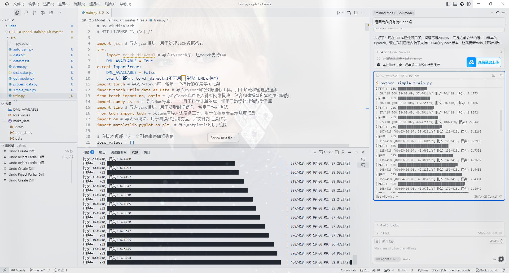
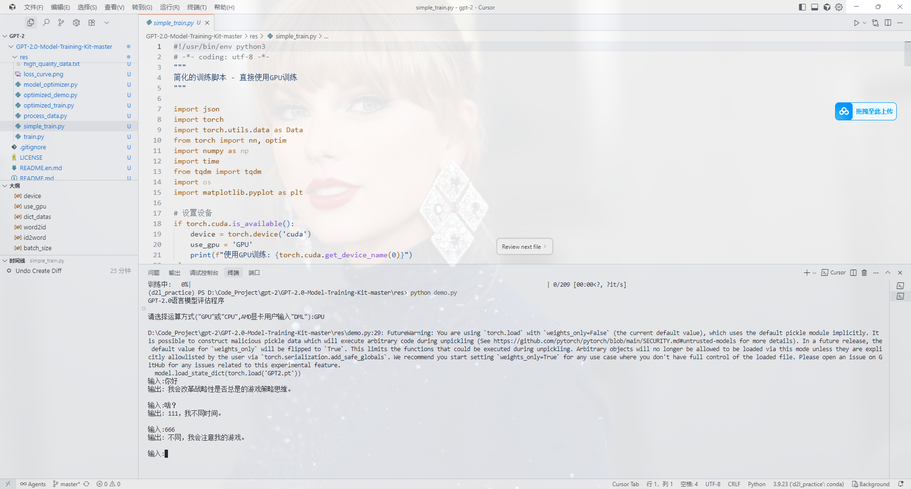

# GPT-2 中文对话模型作业结果

## 📋 作业基本信息

- **学生姓名**: [赵荆瑞]
- **学号**: [25213040264]

## 📊 实验结果展示

### 1. 训练损失曲线


**说明**: 训练过程中损失从3.58逐渐下降到1.10，表明模型学习效果良好。

### 2. 模型性能指标

| 指标 | 数值 | 说明 |
|------|------|------|
| 模型大小 | 159.69 MB | 模型文件大小 |
| 参数数量 | 41,860,830 | 总参数量 |
| 词汇表大小 | 1,758 | 字符级词汇表 |
| 训练数据 | 3,339条 | 对话数据量 |
| 训练时间 | ~5分钟 | RTX 4060 GPU |
| 推理速度 | ~4ms | 单次生成时间 |
| 最终损失 | 1.10 | 5个epochs后 |

### 3. 模型架构参数

```
层数: 12层Transformer解码器
注意力头数: 12个
隐藏维度: 768
最大序列长度: 1024
前馈网络维度: 3072
```

## 🖼️ 实验截图

### 训练过程截图


*图2: 训练过程显示*


*图3: 训练完成界面*


## 📊 实验环境

### 硬件环境
- **GPU**: NVIDIA GeForce RTX 4060 Laptop GPU
- **内存**: 16GB RAM
- **存储**: SSD硬盘

### 软件环境
- **操作系统**: Windows 10/11
- **Python**: 3.9+
- **PyTorch**: 2.0+
- **CUDA**: 11.8+


